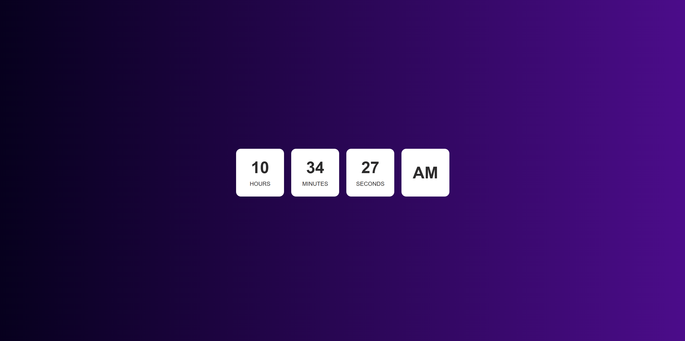

# ⏰ Digital Clock Project

A simple and elegant **Digital Clock** built with **HTML** and **CSS**, perfect for showcasing time display on websites or as part of UI designs.

## 📸 Screenshot

### ✨ Digital Clock UI Example


## 🚀 Features

- ⏳ Real-time time display (if integrated with JavaScript)
- 🎨 Clean and modern clock interface  
- 📱 Responsive design — looks great on all devices  
- ✅ Built with pure **HTML** and **CSS** (basic static design)  
- 💻 Easy to integrate and customize  

## 🛠️ Tech Stack

- Markup: **HTML5**  
- Styling: **CSS3**  

## 📌 Installation & Setup

### Prerequisites
- 📌 A modern web browser (Chrome, Firefox, Edge, or Safari)  
- 📌 A code editor (like VSCode)  

### Steps
1. 📥 Clone the repository:
   ```bash
   git clone https://github.com/shelavalepallavi/digital-clock.git


📁 Open the project folder in your code editor.

🌐 Open index.html in your browser to view the digital clock design.

🎯 Usage
Copy the digital clock structure from index.html.

Add the styles from style.css to your own project.

Customize the clock appearance (fonts, colors, sizes) as per your design needs.

🚀 Deployment
Deploy this project on platforms like:

GitHub Pages


🙌 Contributing
Have ideas for improving the design or adding features? Contributions are welcome! 😊
